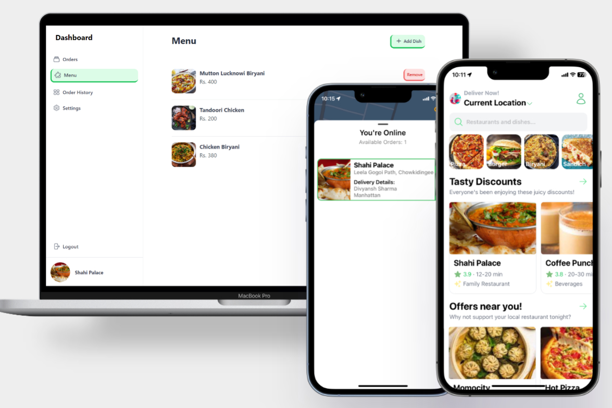

# FoodExpress: Full-Stack Food Delivery Ecosystem

FoodExpress is a comprehensive, multi-platform food delivery solution featuring a customer app, a driver app, and a restaurant management dashboard. Built with modern technologies like React Native, Next.js, and Firebase, it provides a seamless experience for users, delivery partners, and restaurant owners.



## 🚀 Project Overview

This ecosystem is designed to handle the entire lifecycle of a food order, from placement to real-time tracking and delivery confirmation.

### 📱 Customer App (`user-side`)
Built with **React Native** and **Expo**, the customer app allows users to:
- **Browse & Search**: Explore local restaurants and cuisines.
- **Real-time Cart**: Seamlessly add items and manage orders.
- **Secure Checkout**: Integrated payment flow.
- **Order Tracking**: Real-time status updates via Firebase.

### 🚴 Driver App (`driver-app`)
A dedicated mobile application for delivery partners to:
- **Manage Deliveries**: Accept/decline incoming delivery requests.
- **Interactive Maps**: Real-time navigation to restaurant and customer locations using Google Maps.
- **Status Updates**: Mark milestones (Picked Up, Delivered).

### 📊 Restaurant Dashboard (`restaurant-dashboard`)
A **Next.js** web application for restaurant owners to:
- **Order Management**: Monitor and process incoming orders in real-time.
- **Menu Control**: Add, edit, or remove dishes and manage pricing.
- **Business Insights**: Overview of restaurant performance.

---

## 🛠️ Tech Stack

- **Mobile**: React Native, Expo, NativeWind (Tailwind CSS)
- **Web**: Next.js, Tailwind CSS
- **Backend & Real-time**: Firebase (Firestore, Auth, Storage)
- **Navigation**: React Navigation, Google Maps API
- **State Management**: Redux Toolkit

---

## ⚙️ Installation & Setup

### 1. Clone the repository
```bash
git clone https://github.com/ankit-gupta-git/foodexpress-ai-food-delivery-mobile-app.git
cd foodexpress-ai-food-delivery-mobile-app
```

### 2. Setup the Customer App
```bash
cd user-side
npm install
npx expo start
```

### 3. Setup the Driver App
```bash
cd ../driver-app
npm install
npx expo start
```

### 4. Setup the Restaurant Dashboard
```bash
cd ../restaurant-dashboard
npm install
npm run dev
```

---

## 📄 License

This project is licensed under the MIT License - see the [LICENSE](LICENSE) file for details.

---

**Developed by Ankit Gupta**
